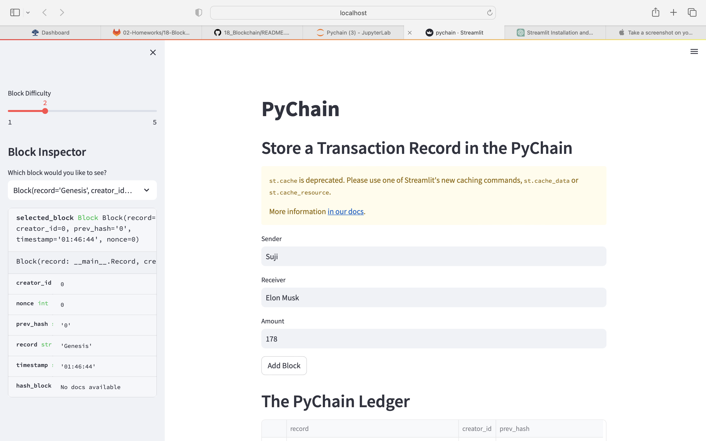

# PyChain Ledger

PyChain Ledger is a blockchain-based ledger system with a user-friendly online interface. The goal of this project is to enable partner banks to undertake financial transactions, such as money transfers between senders and receivers, while ensuring the integrity of the ledger's data.

## Steps completed

Create a new data class named Record. This class will serve as the blueprint for the financial transaction records that the blocks of the ledger will store.
Modify the existing Block data class to store Record data.
Add Relevant User Inputs to the Streamlit interface.
Test the PyChain Ledger by Storing Records.
https://github.com/Sujandar/Pychain/blob/a6f99c6efefd728f0bdbc7f2a9922f8c3ad1b96c/Screenshot%202023-06-29%20at%209.52.42%20PM.png)

